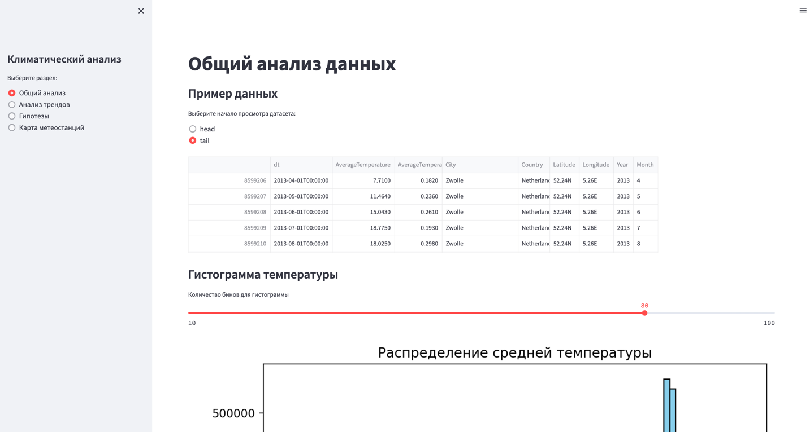
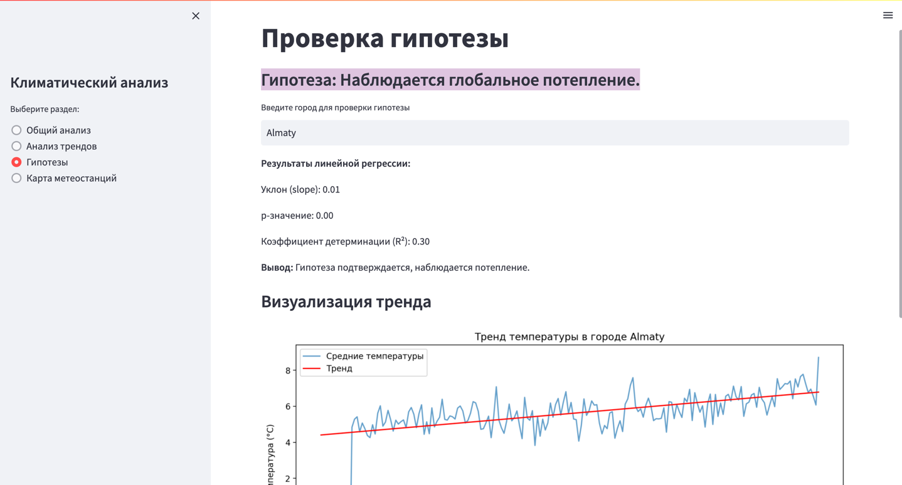

## Климатический анализ c использованием Streamlit для визуализации данных


### How to tun?
- install requirements
```bash
pip install -r requirements.txt --no-cache-dir
```
- скачайте датасет (https://www.google.com/url?q=https://www.kaggle.com/datasets/berkeleyearth/climate-change-earth-surface-temperature-data?resource%3Ddownload&sa=D&source=docs&ust=1732716655094480&usg=AOvVaw0oSFKHht6h_sRWnQeSgOtV) 
- unzip file и поместите в папку `data` по пути:
```bash
data/GlobalLandTemperaturesByCity.csv.zip
```
- run streamlit application
```bash
streamlit run main.py     
```

### How to add new section (page)? 
- create new `page.py` file in the sections folder
- add new section in the `main.py`

---- 

## Страницы

### 1. Общий анализ



### 2. Анализ трендов температуры


- при вводе неверного города


### 3. Проверка гипотезы на глобальное потепление




### 4. Карта метеостанций


### 5. По странам


